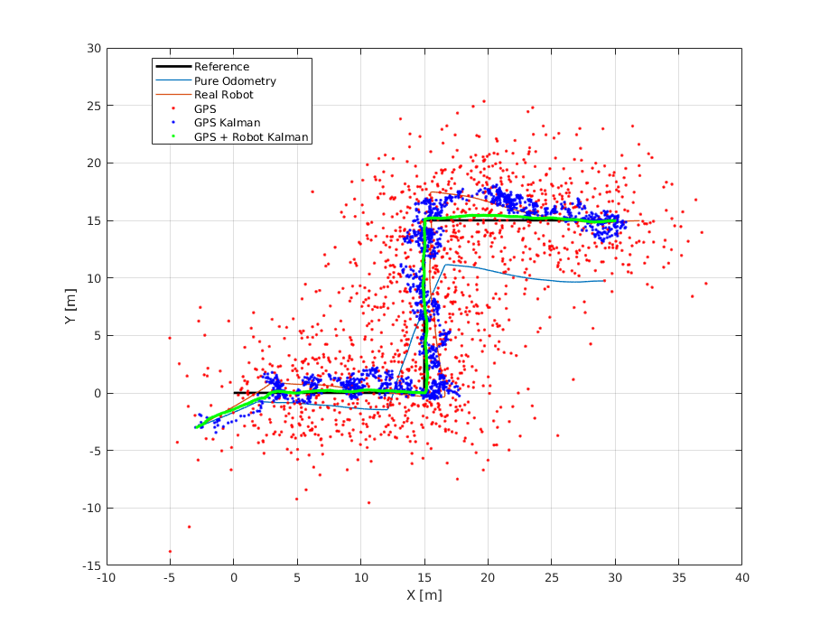

# Mobile Robot GPS Only Data Fusion

This fusion algorithm uses low-cost imprecise GPS measurements (using Matlab GPS model) and two Kalman Filters to estimade the (x,y) position of the mobile robot.

